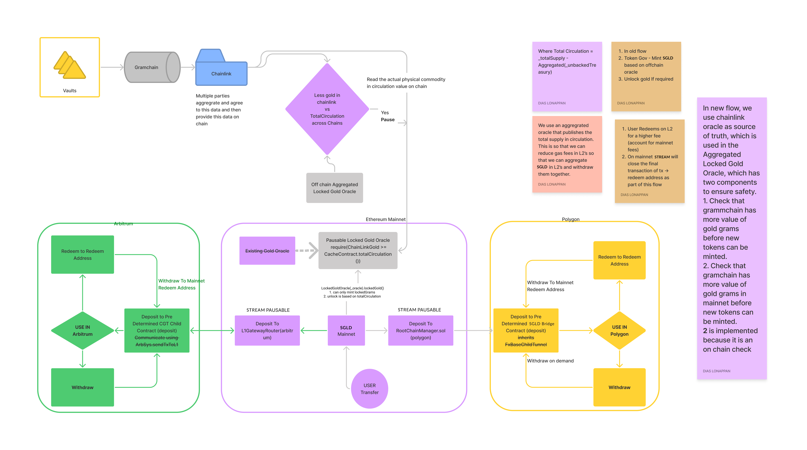

## Introduction
This repo is meant for the cross chain bridge contracts for Stream Protocol / Stream Gold. Ethereum layer 2's and other chain information will be hosted in this repository, with smart contracts and tests in each chain hosted in their respectively named folders.

Token -> RootTunnel<BaseRootTunnel> -> FxRoot -> StateSender -> Checkpoints(Merrkle Tree, Heimdall nodes) -> FxChild -> RootChildContract -> ChildToken (Mints)

## Design philosophies

1. Keep it simple
1. Be able to have our own token with the fees on transfer model on other chains
1. We should not do anything that generates fees for no reason
2. We should not compromise usability for saving gas fees

## Workflow

We deploy Stream bridges and enable feature flags to allow us to quickly deploy faster. The planned phases are as follows:

1. For now we will first just deploy, keep redemptions only on mainnet using a simple no mint no redeem address function on Polygon.
2. feature flag- Enable redemptions on that blockchain, the chain has a local redeem and unbacked treasury address, only cache can withdraw back to the mainnet from this address.

Upon each redemptions event an offchain aggregator listens and computes the data and has the ability to use Stream Gold token governor to pause the oracle in case there is a discrepancy between
the Chainlink blockchain feed and aggregated total circulation.
We lazy transfer from the unbacked in each local chain to the master chain when there is enough SGLD tokens in each chain to make the costs of bridge transfer make sense.

An offchain adapter that aggregates the oracle data for total circulation is used as illustrated in the following diagram:

Here we use Chainlink oracle  as the main oracle that gives us the data of how much Stream Gold tokens are available in the different vaults. We augment this by aggregating data from different chains 

Potential Issue:
Total circulation on mainnet on the Stream Gold Smart contract will not add up immediately, but will reach eventual consistency. We need to make it sufficiently clear on chain to not use the total circulation as a source of truth for applications that require immediate information to this. For eg. on the cache site we can show the aggregated oracle data and the Chainlink feed, both of which will always be correct else the minting and unlock function will be paused.

## Polygon Cross-Chain 
We derive Stream Gold contracts from FX-Portal repo, we create a simplified Stream Gold smart contract and then deploy that as the bridge contract with required FX extensions

for FxERC20BridgeTunnel -> _tokenTemplate -> derived simplified $SGLD
for FxERC20RootTunnel -> _fxERC20Token -> derived simplified $SGLD

## ToDo
   
RootToken

Smart contract FxBridgeRootTunnel on Etherscan:

Smart contract FxERC20BridgeTunnel on mumbai:

Smart contract StreamGoldBridge on mumbai:

## Testing

### Test Coverage 
Current unit tests are used to verify that the upgraded Stream Gold smart contract behaves as expected.

Additional tests for cross-chain in progress via matic.js sdk

### Manual testing via Testnet
1. Get some goerli eth https://goerli-faucet.mudit.blog/
2. Get some test $SGLD -> Send address to Stream team
3. Approve transfer of test $SGLD 
4. https://goerli.etherscan.io/token/0x1542ac6e42940476c729680ff147e0cedcfcfcf2
5. Call approve where spender is 0x61FFeAC0E2467e58173FfD15c0F993F890f989f6 and amount has 8 decimals
6. Goto https://goerli.etherscan.io/address/0x61FFeAC0E2467e58173FfD15c0F993F890f989f6#writeContract
7. call `deposit` where
rootToken (address) - "0x1542ac6e42940476c729680ff147e0cedcfcfcf2"
bridgeToken (address) - "0x5d20692Be3324110E4D258D4ec0d129Dc39040E5"
user (address) - "The address that should receive Stream Gold tokens on Mumbai"
amount (uint256) - Amount to transfer 8 decimals
data (bytes) - "0x00"
8. After 15 minutes/20 minutes verify your balance on Polygon scan - 
https://mumbai.polygonscan.com/address/0x89F8f1734abe1AB8AdBCa64bAbc187f95b4BCcC8#readContract

Transfer from L2 to L1 requires first calling withdraw on Bridge chain 
1. https://mumbai.polygonscan.com/address/0x617d6f361AF9314E31B6675f174a2321abE929AE#code
2. Note down tx hash
3. 3. goto <stream-matic.js>/examples/pos/erc20/withdraw_exit.js
4. Set the new transaction hash
5. Execute the js script
   
   We have made two modifications to the original matic.js files, both since there are some hard coding in the original js framework. Issue to be reported to the matic team.

eg. 0x7b46ea25a2d637dce05f7518e6b44c283f23593e9e9bff615054142a26b7722d 

In order to reduce the burden for our user's we will make this into a UI which they can then use their wallet to claim.

## Deployment Guidelines
1. Deploy Bridge Token
2. Deploy Bridge tunnel
3. Deploy Root Tunnel
4. Run Bridge Tunnel Post Actions
5. Run Root Tunnel Post Actions
